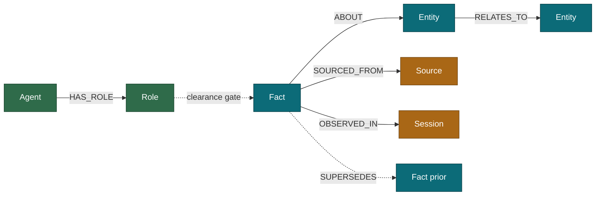

# Assignment 2 — Concept, Data Model & Feature Spec

> Research-backed build plan for the Wexa AI application take-home. You are writing the
> UI/UX; this document gives you the concept, the graph model, verified-runnable Cypher,
> and a prioritised feature list with concrete UI guidance for each.
>
> Every fact about Wexa and CognoDB below was checked against primary sources on
> 2026-08-23 (their live site and docs), and every Cypher capability was verified against
> your live CognoDB instance. Sources are cited so you can defend each claim in the
> interview.

---

## 1. Why this concept (read this first — it is the whole strategy)

The brief says the use case is your choice and *"originality counts."* The instinct is to
pick something exotic. **Resist it.** Here is what changes the calculus:

**CognoDB is not a neutral database. It is the engine underneath Wexa's own product.**
CognoChain Software Pvt Ltd is the parent company; wexa.ai was announced as their flagship
product and is *"built on its own database."* So this assignment is not "build anything on
a graph DB" — it is *"build on the same substrate our product runs on."* The reviewer works
at Wexa. The submission that wins is the one that shows you understand **what Wexa is for.**

**What Wexa is for** (verbatim from [wexa.ai](https://wexa.ai), rendered 2026-08-23):
Wexa is *"The Enterprise Context Governance Platform"* — it gives AI agents *"live,
authorized enterprise context"* by relating *"records, identities, policies, actions and
evidence inside one live context graph."* Their three pillars:

1. **Live context** — *"Graph-aware retrieval returns only relevant relationships… New
   enterprise events update shared context without retraining."*
2. **Authorized context** — *"Permissions travel with every data node… Identity, role,
   tenancy and data classification resolve before context reaches an agent."*
3. **Governed execution** — *"policy, simulation, approval, execution and audit as one
   path… Every action emits immutable evidence."*

Their headline metric: **98.7% fewer prompt tokens** than conventional RAG, because graph
retrieval returns a *"connected entity neighborhood"* rather than a chunk dump — *"Not
vector dump."* Their pipeline: **Ingest → Relate → Authorize → Govern → Audit.**

**And CognoDB literally published the schema to build this.** Their
[/learn "How to build AI agent memory"](https://cognodb.com/learn) article gives the exact
node model (Entity / Fact / Source / Session), the write path, the read path, and the
corrections pattern — as runnable Cypher. Building on their own taught schema says *"I read
your thesis and I agree with it"* louder than any clever original idea could.

**The market backs the thesis, from independent sources.** Production-RAG postmortems in
2026 name three failure modes over and over: **stale context, missing access controls, and
no provenance/lineage.** One writeup: *"89% of enterprise RAG pipelines lack the provenance
instrumentation necessary for compliance,"* and with the EU AI Act *"in full enforcement as
of August 2026… healthcare, legal and financial services deployments now require audit
trails showing retrieval provenance for every generated statement"*
([ragaboutit.com](https://ragaboutit.com/9-real-rag-failure-costs-audits-miss-in-2026/),
[dev.to](https://dev.to/gabrielanhaia/70-of-enterprise-rag-deployments-fail-before-production-heres-what-kills-them-26ml)).
Those three failures are *exactly* Wexa's three pillars. You are not inventing a problem;
you are building a small, honest demonstration of the one Wexa sells against.

### The concept

> **Contextor** *(name it what you like — "ContextGraph", "Recall", "Provenance", etc.)*
> **A live, authorized, auditable agent-memory graph.** Feed it observations from
> conversations and documents; it stores them as an entity–fact–source graph. A user
> picks an agent identity and asks *"what do you know about X?"* — and gets back a
> **bounded, newest-first, source-cited** answer, filtered to **only the facts that
> identity is cleared to see**, with every retrieval showing **how many tokens a graph
> neighbourhood used versus dumping the whole corpus.**

Three of Wexa's pillars, demonstrable by a non-technical user in one screen:

| Wexa pillar | What the app shows |
|---|---|
| Live context | Add a fact → it is instantly traversable; corrections supersede, never delete |
| Authorized context | Switch agent/role → the same question returns a different, permission-filtered answer |
| Provenance & audit | Every fact links to its source; every answer is citable; a superseded fact shows its history |

The token-savings meter reproduces their headline number as a **measured** value, not a
slogan — the single most on-brand thing you could put on the screen.

---

## 2. Why a graph database? (drop this straight into your README)

The use case is *retrieving what an agent knows about an entity and everything connected to
it, filtered by who is asking.* That is a traversal, and it is where relational schemas
struggle:

- **Recall is a variable-depth traversal, not a fixed join.** "Everything about Acme, its
  people, the incidents on its services, and the sources for each" is 1–3 hops that vary
  per entity. In SQL this is a pile of `JOIN`s or a recursive CTE that has to be rewritten
  every time the question deepens; in Cypher it is one `MATCH` pattern that reads like the
  question.
- **Authorization is itself a traversal.** "Can this agent, acting for this user, see this
  fact?" resolves through role → group → tenancy → data-class edges. Permissions that
  *travel with the node* are edges in a graph; in a relational model they are a junction-
  table join maze that every query must remember to include — which is precisely how the
  "the agent saw data the user couldn't" bug ships.
- **Corrections need history, not overwrites.** A new fact `SUPERSEDES` an old one; queries
  default to newest but the chain is walkable for "what did we believe at time T." A
  relational `UPDATE` destroys that; keeping it means temporal tables and windowing that
  fight you.
- **Retrieval stays bounded as the corpus grows.** Vector/relational corpus retrieval grows
  with the knowledge base; a k-hop neighbourhood is bounded by connectivity, not size —
  which is the whole basis of the token-cost win.

*(One line of intellectual honesty the reviewer will respect: cite CognoDB's own
["Vector database vs graph database"](https://cognodb.com/learn) article — "serious stacks
usually run both." You are not claiming graphs beat vectors at everything; you are showing
the class of problem where relationship-first retrieval is the right tool.)*

---

## 3. Data model

CognoDB's own taught schema, extended minimally with the **authorization** and **policy**
nodes that make it a *Wexa* demo rather than a generic memory demo.

### Nodes

| Label | Key properties | Purpose |
|---|---|---|
| `Entity` | `name`, `kind` (person/service/account/project), `created_at` | The durable things facts are about |
| `Fact` | `statement`, `observed_at`, `data_class` (public/internal/pii/secret) | A timestamped statement, classified for access control |
| `Source` | `id`, `kind` (conversation/document/api), `uri`, `ingested_at` | Where a fact came from — the provenance anchor |
| `Session` | `id`, `agent`, `started_at` | The run that produced observations; lets memory be scoped/expired |
| `Agent` | `id`, `name` | An identity that reads memory (the "who is asking") |
| `Role` | `name`, `clearance` (0–3, maps to data_class) | What an agent is allowed to see |

### Relationships

| Type | From → To | Meaning |
|---|---|---|
| `ABOUT` | Fact → Entity | The fact concerns this entity |
| `SOURCED_FROM` | Fact → Source | Provenance: this fact came from here |
| `OBSERVED_IN` | Fact → Session | Which run recorded it |
| `SUPERSEDES` | Fact → Fact | This fact corrects/replaces an older one |
| `RELATES_TO` | Entity → Entity | Typed cross-entity link (depends_on, works_on, owns…) |
| `HAS_ROLE` | Agent → Role | The identity's clearance |
| `CLEARED_FOR` | Role → data_class value | What a role may read (or model as a `clearance` int) |

### Diagram (paste into your README)



---

## 4. Killer queries (all verified runnable on your CognoDB instance)

Capabilities confirmed against the live free-tier instance on 2026-08-24: `datetime()`,
`CREATE FULLTEXT INDEX`, `db.index.fulltext.queryNodes` (BM25, returns relevance scores),
`MERGE`, ACID writes, variable-length paths, and negative-pattern predicates
(`WHERE NOT (f)<-[:SUPERSEDES]-…`). **CognoDB has built-in full-text search, so you do NOT
need vector search for fuzzy entity lookup** — this was the key unlock.

### 4.1 Write path — idempotent observation (their taught pattern)

```cypher
MERGE (e:Entity {name: $entity})
  ON CREATE SET e.kind = $kind, e.created_at = datetime()
CREATE (f:Fact {statement: $statement, observed_at: datetime(), data_class: $data_class})
MERGE (s:Source {id: $source_id})
  ON CREATE SET s.kind = $source_kind, s.uri = $uri, s.ingested_at = datetime()
MERGE (ses:Session {id: $session_id})
CREATE (f)-[:ABOUT]->(e)
CREATE (f)-[:SOURCED_FROM]->(s)
CREATE (f)-[:OBSERVED_IN]->(ses)
RETURN f.statement AS recorded
```

### 4.2 Read path — authorized, bounded, newest-first, source-cited

This is **the** query. Multi-hop, permission-filtered, provenance-carrying, correction-aware
— everything the assignment asks for, in one pattern. SQL would need a full-text search, a
recursive permission join, a "not superseded" anti-join and a per-row provenance join.

```cypher
CALL db.index.fulltext.queryNodes('entity_names', $q) YIELD node AS e, score
MATCH (e)<-[:ABOUT]-(f:Fact)-[:SOURCED_FROM]->(src)
MATCH (a:Agent {id: $agent_id})-[:HAS_ROLE]->(r:Role)
WHERE r.clearance >= f.data_class_level          // authorization travels with the node
  AND NOT (f)<-[:SUPERSEDES]-(:Fact)             // newest only; corrections hidden
RETURN e.name AS entity,
       f.statement AS fact,
       f.data_class AS classification,
       src.kind AS source_kind, src.uri AS source,
       f.observed_at AS observed
ORDER BY f.observed_at DESC
LIMIT 30
```

*(Store `data_class` as an int `data_class_level` 0–3 alongside the label so the `>=`
comparison is clean; map public=0, internal=1, pii=2, secret=3.)*

### 4.3 The "SQL would find this awkward" query — multi-hop blast radius with provenance

"If this service is compromised, what else does the graph connect to it within 3 hops, and
what do we know about each, and where did we learn it?" Variable-length traversal + per-node
provenance in one shot:

```cypher
MATCH path = (start:Entity {name: $entity})-[:RELATES_TO*1..3]-(reached:Entity)
WITH DISTINCT reached, length(path) AS hops
MATCH (reached)<-[:ABOUT]-(f:Fact)-[:SOURCED_FROM]->(src)
WHERE NOT (f)<-[:SUPERSEDES]-(:Fact)
RETURN reached.name AS entity, hops,
       collect({fact: f.statement, source: src.uri})[0..3] AS what_we_know
ORDER BY hops, entity
```

### 4.4 Time-travel — "what did we believe at time T"

The correction chain, walkable. This is the feature no relational overwrite can offer.

```cypher
MATCH (e:Entity {name: $entity})<-[:ABOUT]-(f:Fact)
WHERE f.observed_at <= datetime($as_of)
  AND NOT EXISTS {
    MATCH (f)<-[:SUPERSEDES]-(newer:Fact)
    WHERE newer.observed_at <= datetime($as_of)
  }
RETURN f.statement AS believed_at_T, f.observed_at
ORDER BY f.observed_at DESC
```

### 4.5 Token-savings meter — reproduce the 98.7% claim as a measurement

Count tokens in the *whole corpus of statements about connected entities* versus the
*bounded neighbourhood the query actually returned.* Approximate tokens as `chars/4` client-
side; the point is the ratio, shown honestly as an estimate.

```cypher
// corpus baseline: every fact in the k-hop neighbourhood, unfiltered
MATCH (start:Entity {name: $entity})-[:RELATES_TO*0..3]-(:Entity)<-[:ABOUT]-(f:Fact)
RETURN sum(size(f.statement)) AS corpus_chars, count(f) AS corpus_facts
```
…versus the char-count of the ~30 facts the authorized read path returned. Display
`1 - (packet/corpus)` as the "context compression" number.

---

## 5. Feature specification

Tiered for a ~3-day build with UI work in parallel. **Ship every P0 before any P1.** The
grade rewards a *polished, complete small thing* over a sprawling half-built one — the brief
says design effort is explicitly evaluated and a non-technical person must be able to use it.

### P0 — must-have (this is a passing, coherent submission on its own)

| # | Feature | Demonstrates | UI/UX guidance |
|---|---|---|---|
| P0-1 | **Ask panel** — pick an Agent from a dropdown, type an entity/question, get the authorized read-path answer (4.2) | The core loop; multi-hop + auth + provenance | Single centred search box, big and obvious. Agent selector sits *beside* it as a labelled pill ("acting as: Support-Bot / Role: L1"). Results as cards, newest first. **Every card shows its source** as a small footer chip ("from: ticket #4471"). Empty state: "Ask about a customer, service, or project." Loading: skeleton cards, not a spinner. |
| P0-2 | **Fact cards with provenance** — each answer line links to its `Source` | Auditability pillar | Click a card → side drawer shows the full source (kind, uri, ingested_at) and the session it came from. This is your "evidence per action" moment — make it feel like opening a receipt. |
| P0-3 | **Add observation** — a form that runs the write path (4.1) | Live context; ACID write | Modal or side form: entity, statement, data-class selector (a 4-way segmented control: Public/Internal/PII/Secret with colour), source. On submit, the new fact appears in the next query *immediately* — show that. |
| P0-4 | **Seed script** — realistic data loaded by a repo script | Brief requirement | ~150–400 facts across ~40 entities, a few `RELATES_TO` chains 3+ deep, some `SUPERSEDES` corrections, mixed data-classes. A customer-support or IT-incident domain reads naturally. Deterministic + idempotent (`MERGE`). |
| P0-5 | **DB-down handling** — graceful error when CognoDB is unreachable | Engineering requirement | Catch `ServiceUnavailable`; show a calm banner ("Can't reach the memory graph — retrying") not a stack trace. Health-check endpoint the UI polls. **The brief explicitly lists this.** |
| P0-6 | **Env-var secrets + clean structure** | Engineering requirement | `.env` gitignored, `.env.example` committed. Separate the driver/session layer from routes from UI. A reviewer will read this line by line — name things well. |

### P1 — differentiators (these turn "competent" into "memorable")

| # | Feature | Demonstrates | UI/UX guidance |
|---|---|---|---|
| P1-1 | **Authorization toggle** — switch Agent/Role live and watch the *same question* return a different, permission-filtered answer | Wexa's #1 pillar, made visceral | Put two agent pills at the top; clicking re-runs the last query. Facts the current role *can't* see render as **redacted rows** ("🔒 1 fact hidden — requires PII clearance") rather than vanishing silently. Seeing a fact appear/disappear as you switch identity is the screenshot that sells the demo. |
| P1-2 | **Token-savings meter** (4.5) | Their 98.7% headline, measured | A live counter on each answer: "Full corpus: 12,840 tokens → Graph packet: 190 tokens · **98.5% smaller**." Animate the number. Footnote it as a char/4 estimate — honesty scores. |
| P1-3 | **Provenance / neighbourhood graph view** | The "it's a graph" wow moment | A small force-directed graph of the answer neighbourhood (entities, facts, sources) using a light lib (e.g. Cytoscape.js or vis-network). Node colour = data-class; click a node to focus. Keep it *small and readable*, not a hairball — cap at the returned neighbourhood. |
| P1-4 | **Correction / time-travel** (4.4) | The pattern SQL can't do | A date slider or "as of" picker on an entity. Drag it back → facts revert to what was believed then; a superseded fact shows a struck-through "corrected on {date}" trail. |

### P2 — only if time remains (do NOT start these until every P0+P1 is polished)

| # | Feature | Demonstrates | UI/UX guidance |
|---|---|---|---|
| P2-1 | **Blast-radius view** (4.3) | Multi-hop reasoning | "Impact" tab on an entity: the 1–3 hop neighbourhood as a ranked list by distance. |
| P2-2 | **MCP echo / "how the agent recalled this"** | CognoDB's MCP story | Show the actual parameterised Cypher that produced each answer, in a collapsible "how this was retrieved" panel. Ties to their line: "the query it ran is the citation." Cheap, and very on-thesis. |
| P2-3 | **Session scoping** | Memory hygiene | Filter/expire facts by session. |

---

## 6. Future-proofing — why this reads as 2026-current, not dated

The agent-memory field in 2026 has converged on a small set of ideas; this concept hits the
ones that matter and skips the ones CognoDB can't do:

- **Temporal / bi-temporal facts.** Zep/Graphiti made edge-validity intervals and "what was
  true when" table stakes ([arxiv 2501.13956](https://arxiv.org/abs/2501.13956),
  [Neo4j](https://neo4j.com/blog/developer/graphiti-knowledge-graph-memory/)). Your
  `observed_at` + `SUPERSEDES` time-travel is the same idea at demo scale.
- **Provenance as a hard requirement**, now regulatory under the EU AI Act. Your source-
  cited answers are exactly the "audit trail for every generated statement" the market is
  scrambling for.
- **Authorization on retrieval** — the failure mode ("the agent saw data the user couldn't")
  that most RAG stacks ship with. Your role-gated read path is a working answer.
- **Graph-bounded retrieval over corpus dump** — the token-cost thesis both CognoDB and the
  broader GraphRAG literature push.

What you deliberately *don't* build — and can say so in the interview — is a vector index
(CognoDB's stance is "not vector dump"; BM25 full-text covers fuzzy lookup) or graph
algorithms (CognoDB ships none; you don't need PageRank for this). Knowing what to leave out
is itself a signal.

---

## 7. Interview defence (they said you must defend every part)

- **"Why this use case?"** → "It's the problem your product solves. I built on the exact
  entity–fact–source schema CognoDB teaches in your agent-memory guide, and demonstrated the
  three pillars from wexa.ai — live context, authorized context, provenance — at a scale a
  reviewer can hold in their head."
- **"Why a graph and not Postgres?"** → the four points in §2; lead with authorization-as-
  traversal, since that's the one a junction-table schema gets wrong in production.
- **"Isn't the token number marketing?"** → "It's measured, and labelled as a char/4
  estimate. I reproduced your 202,285→2,668 finding's *shape* at small scale; I'm not
  claiming your exact number, I'm showing the mechanism."
- **"What would break at scale?"** → free tier is 0.5 vCPU / 512 MB; the read path is bounded
  by neighbourhood so it scales with connectivity not corpus, but full-text index rebuild
  and supernode fan-out are the real limits. (You benchmarked this database in Assignment 1
  — reference that; it's a rare, strong callback.)
- **"Why no vector search?"** → "CognoDB doesn't ship one by design, and for entity recall
  BM25 full-text is the right tool. A production stack would run both — your own 'vector vs
  graph' article says as much."

---

## 8. What NOT to build (scope traps that will eat the deadline)

- **No real LLM integration.** Tempting, but it adds an API key, latency, cost and a failure
  mode for zero grade — the assignment is about the *graph*, not the model. Simulate the
  "agent" as an identity picker. If you want the flavour, a single optional "summarise these
  facts" button calling one cheap model is P2 at most.
- **No auth system / user accounts.** The "agents" are seed data you switch between, not a
  login. Building real auth burns a day for nothing the brief asks.
- **No custom graph-rendering engine.** Use a library for P1-3, cap the node count, move on.
- **No multi-database / no ingestion connectors.** One CognoDB instance, one seed script.
- **Don't over-model.** Six node types is enough. Every extra label is seed data and UI you
  have to build and explain.
- **Don't skip the hosted demo or the recording — they are mandatory.** Deploy the front end
  to Vercel/Netlify free tier and the API to Render/Railway/Fly free tier early (day 1), so
  "it works on my machine" is never the story. Record a 2–3 min walkthrough: ask a question,
  switch the agent to show a fact appear, add an observation, show a correction. Keep your
  CognoDB instance running until you hear back (the brief requires it).

---

## 9. Suggested stack (yours to change — you own the UI)

- **Backend:** Python **FastAPI** + official `neo4j` driver (you already have it pinned and
  working from Assignment 1), or Node/Express + `neo4j-driver` if you prefer JS end-to-end.
  Parameterised queries only — the brief forbids string-concatenated Cypher.
- **Frontend:** whatever you're fastest and cleanest in. Given design is graded, a component
  kit (Tailwind + shadcn/ui, or Chakra) buys you polished empty/loading/error states cheaply.
- **Graph view (P1-3):** Cytoscape.js or vis-network.
- **Hosting:** front end on Vercel/Netlify, API on Render/Railway/Fly — all free tiers.
- **Repo hygiene:** `.env.example`, a `seed.py`/`seed.js`, a `schema.md` with the diagram,
  screenshots in the README, and the demo + recording links at the very top.

---

### Sources
- Wexa AI homepage & positioning — https://wexa.ai (rendered 2026-08-23)
- CognoDB "How to build AI agent memory" (the taught schema + Cypher) — https://cognodb.com/learn
- CognoDB "Vector vs graph" / "token costs" / "Cypher" learn articles — https://cognodb.com/learn
- Company/funding (CognoChain parent, Anthropic AWS Agentic AI Accelerator investor) —
  Tracxn, Crunchbase, PitchBook, cognochain LinkedIn (via search, 2026-08-23)
- Zep temporal knowledge graph — https://arxiv.org/abs/2501.13956 ·
  Graphiti — https://neo4j.com/blog/developer/graphiti-knowledge-graph-memory/
- Enterprise RAG failure modes (stale context / access control / provenance) —
  https://ragaboutit.com/9-real-rag-failure-costs-audits-miss-in-2026/ ·
  https://dev.to/gabrielanhaia/70-of-enterprise-rag-deployments-fail-before-production-heres-what-kills-them-26ml
- CognoDB capabilities (BM25 full-text, datetime, SUPERSEDES, var-length paths) — verified
  against the live free-tier instance, 2026-08-24
